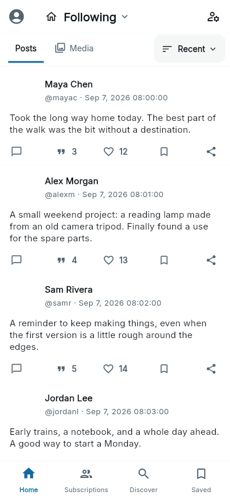
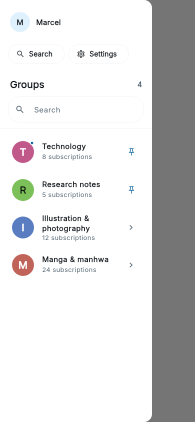
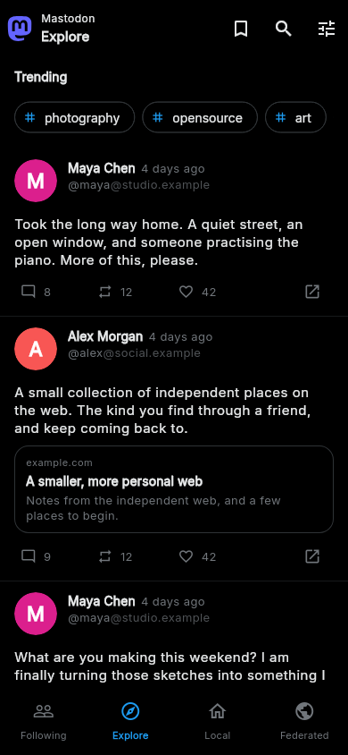
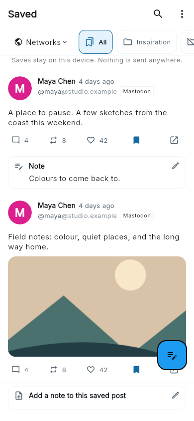

<div align="center">


# XTA

**An Android reader for X, social feeds, articles and artwork.**

Follow locally. Build your own groups. Keep the posts worth coming back to.

[](https://github.com/Aimdi/XTA/releases/latest)
[](https://github.com/Aimdi/XTA/actions/workflows/verify.yml)
[](LICENSE)


**[Download the latest APK](https://github.com/Aimdi/XTA/releases/latest)** ·
[Add to Obtainium](https://apps.obtainium.imranr.dev/redirect.html?r=obtainium://add/https://github.com/Aimdi/XTA) ·
[Release notes](release-notes.md) ·
[Report a bug](https://github.com/Aimdi/XTA/issues)

</div>

XTA brings a configurable Home feed, local subscriptions, groups, Discover and
Saved into one app. Optional plugins add dedicated readers for other networks,
newsletters, artwork and markets, alongside connections to your own services.

XTA is read-oriented: it does not publish posts, replies, quotes, reposts or
likes to X. Following someone or liking a post in XTA is a local action, separate
from your X account's follows and likes.

## A look inside

<p align="center">
  <a href="assets/readme/current/home.png"></a>
  <a href="assets/readme/current/groups.png"></a>
  <a href="assets/readme/current/mastodon.png"></a>
  <a href="assets/readme/current/saved.png"></a>
</p>

Home · Groups · Mastodon · Saved. These previews are rendered from the Aimdi131
UI with sample content, rather than live accounts. Open an image to see it full size.

<!-- Preview sources: home_timeline_layout_test.dart (home-following-light),
home_filter_drawer_review_test.dart (home-group-drawer),
mastodon_client_layout_test.dart (mastodon-black),
app_reading_layout_test.dart (app-saved). Copy reviewed renders into
assets/readme/current/ when refreshing these previews. -->

## Read your way

| Area | What you can do |
|---|---|
| **Home** | Switch sources, open X's dedicated For you feed, move between Posts and Media, and filter active accounts and groups. |
| **Groups** | Organise local follows into pinned or nested groups, combine supported sources, and choose Recent, Popular or custom feeds. Supported account plugins can add followed people to groups. |
| **Discover** | Search posts and people, revisit recent searches, and find unfamiliar authors through reposts and quotes. Connected AI can help discover accounts and organise ungrouped follows. |
| **Reading** | Open conversations, quotes and Community Notes; browse media grids; use Zen mode and reading-position restoration on supported feeds. |
| **Saved** | Keep posts from supported plugins together, filter by network or folder, and attach local notes. |
| **Appearance** | Choose light, dark, True Black, Pitch Black or X Look themes, adjust accents and reading preferences, and customise navigation. |

Features vary by source. Repost and quote readers, for example, depend on what
the service or Mastodon instance exposes. See the [release notes](release-notes.md)
for recent changes, including the follow/group loading fixes.

## Plugins

Open **Settings → Plugin store** to install optional plugins, then use **Open**
for their reader or the settings control to configure them. Plugins are off by
default; X is a built-in Home source and needs no plugin installation.

The app includes the following integrations. The published
[catalogue](plugins.json) controls what the store offers, and an already
installed plugin stays installed when its catalogue availability changes.

| Plugin | Reading or integration features |
|---|---|
| **Threads** | Public profiles, local follows, search and dedicated feed navigation. |
| **Bluesky** | Public accounts, lists and custom feeds, with retained timelines and repost/quote readers. |
| **Mastodon** | Following, Explore, Local and Federated timelines; profiles, media and connected conversations. |
| **Reddit** | Subreddits, post listings and comment threads, with local follows and votes. |
| **Hacker News** | Story feeds and discussions, with local likes and bookmarks. |
| **Substack** | Publication follows, article reading, text-to-speech and podcast playback. |
| **RSS** | Follow feeds, read articles and bring subscriptions into Home and groups. |
| **Booru** | Browse supported imageboard hosts and follow tags into groups. |
| **Stocks & crypto** | Watchlists, charts and cashtag posts; find crypto by ticker or contract, with network-aware identity and DEX Screener quotes. |
| **Karakeep** | Send selected bookmarks to a configured Karakeep instance. |
| **Deepmarks** | Save selected bookmarks through Nostr. |
| **Immich** | Upload photos and videos from a bookmark folder to your Immich server. |

**Private plugins:** Pixiv, Instagram, TikTok and EH/EhViewer are included in the
app but hidden from the default catalogue. Enable **Show private plugins** in
the plugin store to reveal them. Pixiv includes followed-artist groups and a
continuous artwork reader; the other readers provide public-profile media or
gallery browsing as supported by their services. Some features need a service
account, session cookies or a configured server.

## Install and update

XTA requires **Android 7.0 or newer**. Open the
[latest release](https://github.com/Aimdi/XTA/releases/latest), expand **Assets**,
and choose the APK for your device:

| APK filename | Use it for |
|---|---|
| `xta-aimdiNN_arm64-v8a.apk` | Most current Android phones and tablets. |
| `xta-aimdiNN_armeabi-v7a.apk` | Older devices with a 32-bit ARM processor. |
| `xta-aimdiNN_x86_64.apk` | Android devices or emulators using x86_64. |
| `xta-aimdiNN.apk` | A larger universal APK if you are unsure of the architecture. |

`aimdiNN` is the release tag shown on GitHub. Obtainium can track
[`Aimdi/XTA`](https://github.com/Aimdi/XTA) for updates directly from releases.

Current XTA releases use application ID `com.aimdi.xta` and the same release
signing key, so compatible XTA installations update in place. If you are moving
from QuaX or a build with a different application ID or signing key, export a
backup first; Android may treat it as a separate app or reject an in-place update.

Each release includes **`SHA256SUMS`** and **`release-build.json`**. The release
workflow checks the tagged source, APK versions, architectures and signing
certificate before publication. See the [certificate fingerprints](certificate-fingerprints.txt),
[signing guide](docs/signing.md) and [release integrity checks](docs/specs/release-integrity.md).
These checks establish build provenance; independently reproducible APKs are
[still a separate goal](docs/reproducible-builds.md).

## Accounts and privacy

- **X access:** guest requests are attempted when no account is configured, but
  access is limited and can fail. Add an X account for authenticated reading.
  Other plugins have their own account requirements.
- **Local data:** XTA subscriptions, saved posts, notes and local likes are
  stored on your device. Use the app's export/import tools to carry supported
  data between installations. Android's automatic app backup is disabled.
- **Network requests:** reading contacts X or the enabled service. Those
  services can see requests and any credentials supplied to them; local follows
  do not make browsing anonymous.
- **Optional connections:** AI/KI settings include OpenRouter, Grok and OpenAI
  presets, plus editable URLs for OpenAI-compatible servers. For OpenRouter,
  select its preset, enter your API key and full model ID (for example
  [`openrouter/free`](https://openrouter.ai/openrouter/free)), then save. AI features use the provider and key you configure.
  AI requests and actions such as sending a bookmark to Karakeep, Deepmarks or
  Immich transmit data to that chosen service.

XTA uses unofficial APIs for several sources. Upstream changes, rate limits and
expired sessions can interrupt loading. When reporting a problem, include the
XTA release tag, Android version, affected source and steps to reproduce it.

## Build locally

Use [FVM](https://fvm.app/) with the Flutter version pinned in [`.fvmrc`](.fvmrc)
(currently **3.44.4**). You also need Git, Python, **JDK 21** (CI uses
**21.0.10**) and the Android SDK. Android/NDK versions are pinned in
[`android/app/build.gradle`](android/app/build.gradle).

```bash
git clone --branch claude/main https://github.com/Aimdi/XTA.git
cd XTA
fvm install
fvm use

# Merge localisation files by key when working across branches.
bash scripts/setup_git_merge_drivers.sh

# Generate the launcher icons from the current XTA artwork.
python3 -m venv .venv
source .venv/bin/activate
python -m pip install -r requirements.txt
python generate_icons.py
deactivate

fvm flutter pub get
fvm dart run flutter_launcher_icons
fvm dart run intl_utils:generate
fvm dart run flutter_iconpicker:generate_packs --packs material
fvm flutter build apk --debug
```

The debug APK is written to `build/app/outputs/flutter-apk/app-debug.apk`.
This shell example uses Bash. See [cloud testing and Android setup](docs/cloud-testing.md)
and the [SDK setup notes](AGENTS.md#non-obvious-gotchas) for environment-specific details.

Run the checks with:

```bash
fvm flutter analyze --no-fatal-infos
fvm flutter test
python3 scripts/validate_arb.py
bash scripts/check_skill_sync.sh
```

`dart_pubspec_licenses:generate` is omitted from this local recipe because of its
Flutter 3.44.4/FVM compatibility issue; XTA uses Flutter's built-in license page.
Generated localisation and icon packs are required. Release builds use the
existing [signed release workflow](.github/workflows/build-release.yml).

## Contributing and project history

Open issues and pull requests in **[Aimdi/XTA](https://github.com/Aimdi/XTA)**;
the development branch is **`claude/main`**. Read [AGENTS.md](AGENTS.md) and
[CLAUDE.md](CLAUDE.md) before changing code. Preserve the Store architecture,
localisation and pinned dependencies, and keep changes focused.

XTA is developed with assistance from AI coding agents. Automated formatting,
analysis and tests support review; device and live-service testing remain
important for changes to reading, navigation and account access.

XTA builds on [QuaX by Teskann](https://github.com/Teskann/QuaX), which builds on
[Quacker](https://github.com/TheHCJ/Quacker) and
[Fritter](https://github.com/jonjomckay/fritter). Their work forms the foundation
of this app. XTA's own releases use **Aimdi tags**; the retained `4.12.0` app
version alone does not identify an XTA release.

[XTA release history](release-notes.md) ·
[Historical upstream changelog](changelog.md) ·
[MIT license](LICENSE)
